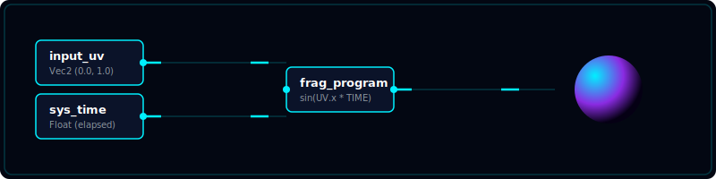

# 🎨 TIRUNARA Profile Designs Catalog

This folder contains the proposed self-contained animated SVGs. They are rendered below so you can see the animations directly.

---

## 🛠️ Components Catalog

### 1. Dev Station Banner
*   **File**: [dev_header.svg](./visuals/dev_header.svg)
*   **Aesthetics**: Charcoal dark panel featuring terminal typing prompts highlighting Systems, Shaders, AI, and developer partner link status.

  

---

### 2. GLSL/Godot Shader Nodes
*   **File**: [shader_nodes.svg](./visuals/shader_nodes.svg)
*   **Aesthetics**: Cyber shader workflow mapping UV -> Fragment Program -> Neon color gradients with glowing pulse triggers.

  

---

### 3. Asynchronous Agent Mesh
*   **File**: [agent_mesh.svg](./visuals/agent_mesh.svg)
*   **Aesthetics**: Pulsing network nodes with SVG animateMotion crawling packets along connections.

  

---

### 4. Language Resource Metrics
*   **File**: [system_metrics.svg](./visuals/system_metrics.svg)
*   **Aesthetics**: Systems resource bars displaying Python, C++, and GDScript as animated memory load monitors.

  

